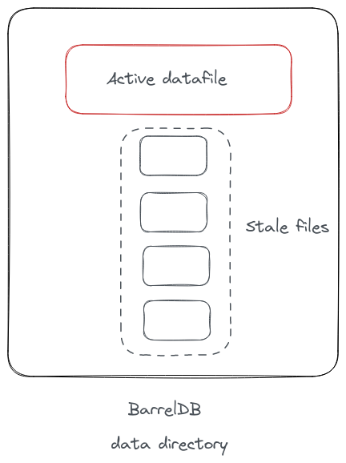
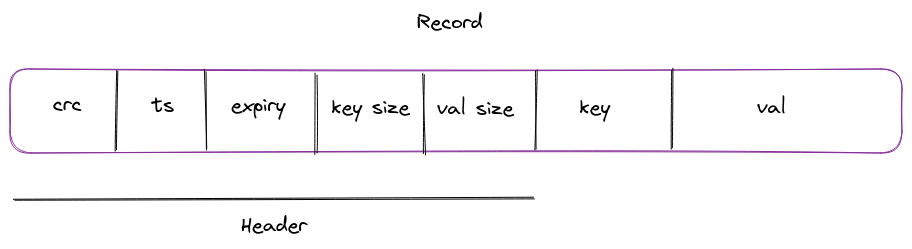
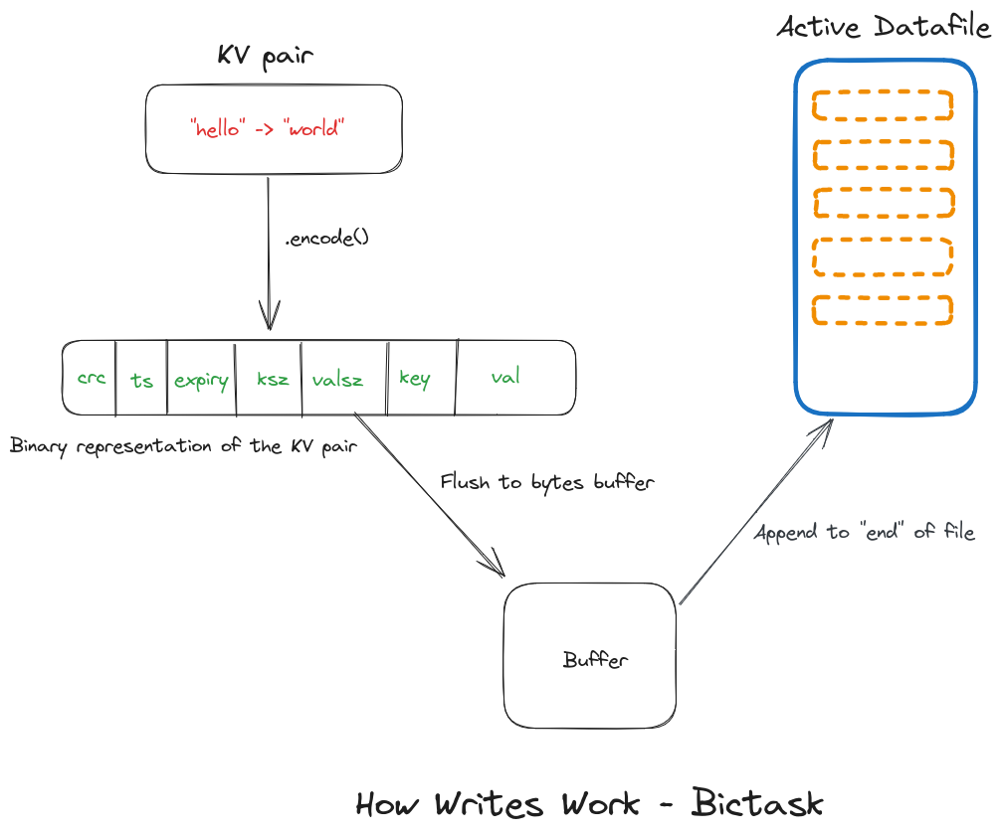

<!-- _class: lead -->
# Bitcask: A Deep Dive

Explore the internals of Bitcask, a disk-based key-value store.

---

# Agenda

1. Introduction to Bitcask
2. Goals for Bitcask
3. Architecture Overview
4. Data Handling: Records & Files
5. The Role of KeyDir
6. Writing, Retrieval, & Merge Processes
7. Enhancements: Hints & Expiry
8. 🚀 Demo & Resources

---

# Introduction

## What is Bitcask?

- Persistent key-value storage
- Developed as a storage backend for Riak
- Log Structured Hash Table for storing Key-Value data

---

# Goals for Bitcask

1. **Fast Enough**
    - Target: Sub-millisecond read/writes
    - Goal: 5-10k writes/second on typical hardware
2. **Resilient Data Management**
    - Crash-resilience & rapid recoveries
    - Seamless backup and restoration
3. **Scalability**
    - Uniform resource use
    - Handles data exceeding RAM size

---

# Architecture Overview

- Each Bitcask instance uses a dedicated data directory
- Single OS process allowed for write access at a time
- This exclusive process acts as the designated "database server"

## Components

- Datafile
- Record
- KeyDir

---



---

# Datafile

- Represents the on-disk DB file
- Append-only record of write operations
- Multiple datafiles per Bitcask instance (1 active + N stale)

```go
type DataFile struct {
    sync.RWMutex        // Ensures safe concurrent access

    writer *os.File     // Points to the file used for writing (active file)
    reader *os.File     // Points to the file used for reading data
    id     int          // Unique identifier for the file
    offset int          // Current write position in the active file
}
```

---

### Dedicated file handlers

```go
  // Create a writer to append data to the database file.
  // os.O_APPEND ensures we start writing at the end of the file.
  // os.O_CREATE will create the file if it doesn't already exist.
  // os.O_WRONLY ensures we're only opening the file for write operations.
  // 0644 sets file permissions: owner can read/write, others can only read.
  writer, err := os.OpenFile(path, os.O_APPEND|os.O_CREATE|os.O_WRONLY, 0644)
  if err != nil {
      // Handle errors that might occur while trying to open the file for writing.
      return nil, fmt.Errorf("error opening file for writing db: %w", err)
  }

  // Create a reader specifically for reading the database file.
  // This is opened in default mode, which is read-only.
  reader, err := os.Open(path)
  if err != nil {
      // Handle errors that might occur while trying to open the file for reading.
      return nil, fmt.Errorf("error opening file for reading db: %w", err)
  }
```

---

# Record

A record in Bitcask contains the following components:




---

## Header

- The metadata is stored with a fixed-width header.
- Each field is represented as `uint32`.
- Total size of the header: 4 bytes/field * 5 fields = 20 bytes

---


```go
/*
Representation of the record stored on disk.
------------------------------------------------------------------------------
| crc(4) | time(4) | expiry (4) | key_size(4) | val_size(4) | key | val      |
------------------------------------------------------------------------------
*/
type Record struct {
	Header Header
	Key    string
	Value  []byte
}

// Header represents the fixed width fields present at the start of every record.
type Header struct {
	Checksum  uint32
	Timestamp uint32
	Expiry    uint32
	KeySize   uint32
	ValSize   uint32
}
```

---

## Bitcask Record: Encoding & Decoding

```go
// Encode takes a byte buffer, encodes the value of header and writes to the buffer.
func (h *Header) encode(buf *bytes.Buffer) error {
    // Using 'binary.Write' to serialize 'h' (the header) into binary format.
    // The binary data is written into the provided buffer.
    // The encoding uses LittleEndian byte order for platform independence.
    return binary.Write(buf, binary.LittleEndian, h)
}

// Decode takes a record object decodes the binary value the buffer.
func (h *Header) decode(record []byte) error {
    // Using 'binary.Read' to deserialize binary data from the record.
    // The decoded data populates 'h' (the header object).
    // The encoding assumes LittleEndian byte order.
    return binary.Read(bytes.NewReader(record), binary.LittleEndian, h)
}
```

---

## KeyDir?

- In-memory hashtable
- Maps keys to metadata (like the position of the key-value pair in the log file)
  - Manages large datasets without storing all values in RAM
  - Enables quick lookups with a single-disk seek

---

# Structure of KeyDir

```go
// KeyDir represents an in-memory hash for faster lookups of the key.
// Once the key is found in the map, the additional metadata, like the offset record
// and the file ID is used to extract the underlying record from the disk.
// Advantage is that this approach only requires a single disk seek of the db file
// since the position offset (in bytes) is already stored.
type KeyDir map[string]Meta

// Meta represents some additional properties for the given key.
// The actual value of the key is not stored in the in-memory hashtable.
type Meta struct {
    Timestamp  int
    RecordSize int
    RecordPos  int
    FileID     int
}
```

---


## How Writes Work

- Step 1: Construct the record
- Step 2: Append the record to the active datafile
- Step 3: Update the KeyDir with the new record's metadata

---

### Step 1: Construct the record

```go
// Construct the header with basic information.
header := Header{
    Checksum:  crc32.ChecksumIEEE(val),
    Timestamp: uint32(time.Now().Unix()),
    KeySize:   uint32(len(k)),
    ValSize:   uint32(len(val)),
}

// Handle record expiry.
if expiry != nil {
	header.Expiry = uint32(expiry.Unix())
}

// Prepare the record using the key and value.
record := Record{
    Key:   k,
    Value: val,
}

// Use a buffer to collect the data for writing.
buf := b.bufPool.Get().(*bytes.Buffer)

// Encode header information into the buffer.
header.encode(buf)

// Write the key and value into the buffer.
buf.WriteString(k)
buf.Write(val)
```
---


### Step 2: Append the record to the active datafile

```go
// Append to the active data file.
offset, err := df.Write(buf.Bytes())
    if err != nil {
    // Handle any errors that may arise when writing data to the file.
    return fmt.Errorf("error writing data to file: %v", err)
}

// Write attempts to append the provided data to the end of the associated db file.
func (d *DataFile) Write(data []byte) (int, error) {
    // Write the data to the associated db file.
	if _, err := d.writer.Write(data); err != nil {
		// If there's an error while writing, return a negative offset and the error.
		return -1, err
	}

	// Store the current size of the file (before the write operation) as the offset.
	// This will be the starting point of the data just written.
	offset := d.offset

	// Adjust the offset for the active file. 
	// This makes sure that subsequent writes append data after this chunk.
	d.offset += len(data)

	// Return the offset where the data starts in the file.
	return offset, nil
}
```

---

### Step 3: Update the KeyDir with metadata for the newly added record.

```go
// Adding the new entry to the KeyDir.
// The KeyDir doesn't store the actual value of the key, only metadata 
// related to its position in the disk file. This ensures faster lookups 
// as the actual value retrieval happens directly from the disk.
b.keydir[k] = Meta{
    // The timestamp when the record was written.
    Timestamp:  int(record.Header.Timestamp),

    // The total size of the record, useful for reading it from the disk later.
    RecordSize: len(buf.Bytes()),

    // The position in the file where the record ends.
    // This allows us to calculate where the record starts when reading it back.
    RecordPos:  offset + len(buf.Bytes()),

    // ID of the data file where the record is stored.
    // Helps in identifying which file to read from when the key is accessed.
    FileID:     df.ID(),
}
```

---



---

## How Reads Work

- Lookup key in KeyDir: O(1) complexity
- Fetch the file position and file ID
- Single disk seek to directly access and retrieve the record

---


---

# Benefits of this Approach

- Minimized disk seeks → faster data retrieval.
- Harnesses the power of filesystem read-ahead cache.
  - No need for a separate caching mechanism!

---

# Concerns

- Records keep getting appended to the end of the file
- Disk usage could grow indefinitely
- Purged records still take space on disk

---

# Merge and Compaction

- Merge multiple "datafiles" into one
- If file size grows too large, rotate the file
- On crash, make the file as immutable and create a new file

---

# How merge works?

- Iterate over all keys in the keydir
- Fetch the values and store them in a new file
- Close all old file handlers
- Atomically replace the active datafile handler with the new one
- Delete stale files from disk

---

```go
// RunCompaction runs cleanup process to compact the keys and cleanup
// dead/expired keys at a periodic interval. This helps to save disk space
// and merge old inactive db files in a single file. It also generates a hints file
// which helps in caching all the keys during a cold start.
func (b *Barrel) RunCompaction(evalInterval time.Duration) {
	var (
		evalTicker = time.NewTicker(evalInterval).C
	)
	for range evalTicker {
		b.Lock()

		if err := b.cleanupExpired(); err != nil {
			b.lo.Error("error removing expired keys", "error", err)
		}
		if err := b.merge(); err != nil {
			b.lo.Error("error merging old files", "error", err)
		}
		if err := b.generateHints(); err != nil {
			b.lo.Error("error generating hints file", "error", err)
		}

		b.Unlock()
	}
}
```

---

## Hints File

- Periodically store keydir on disk
- On startup, load the keys in keydir from the hints file
- Improves startup time as it doesn't need to iterate all datafiles

---

```go
// Encode encodes the map to a gob file.
// This is typically used to generate a hints file.
// Caller of this program should ensure to lock/unlock the map before calling.
func (k *KeyDir) Encode(fPath string) error {
	// Create a file for storing gob data.
	file, err := os.Create(fPath)
	if err != nil {
		return err
	}
	defer file.Close()

	// Create a new gob encoder.
	encoder := gob.NewEncoder(file)

	// Encode the map and save it to the file.
	err = encoder.Encode(k)
	if err != nil {
		return err
	}

	return nil
}
```

---

## Handling expired records

- When reading a record, check if it has expired
- During merge process, remove such keys
- Additional goroutine to periodically remove expired keys from KeyDir

---

<!-- _class: lead -->
# Concluding

Thank you for diving into Bitcask with me!

- **Learn More**: [mrkaran.dev/posts/barreldb](https://mrkaran.dev/posts/barreldb/)
- **GitHub Repo**: [github.com/mr-karan/barreldb](https://github.com/mr-karan/barreldb/)
