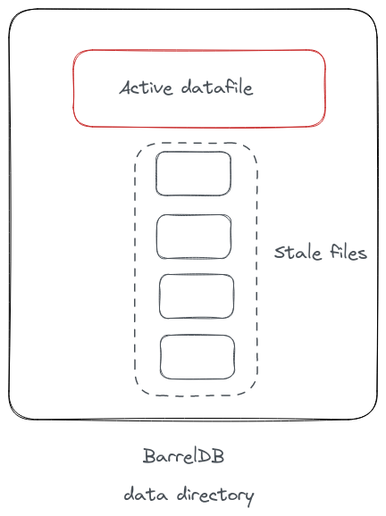
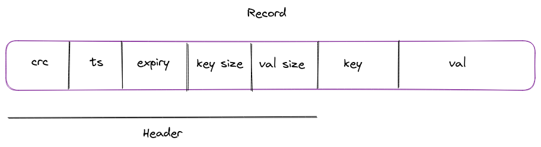
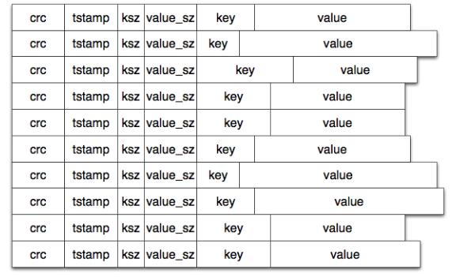
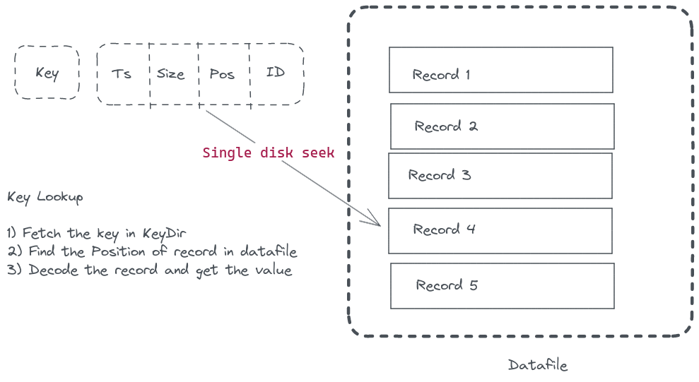

<!-- _class: lead -->

# Bitcask

Learn about internals of Bitcask - a disk based key-value store.

Karan Sharma
[mrkaran.dev](https://mrkaran.dev)

---

# What is Bitcask?

- Persistent key value storage
- Originally designed for Riak - distributed database
- Easy to understand design: https://riak.com/assets/bitcask-intro.pdf

---

# Goals

- Low latency (sub ms) read/writes
- Achieve a throughput of 5-10k writes per second on commodity hardware
- Handle crashes and recover gracefully
- Easy to backup/restore
- Predictable resource usage
- Handle datasets larger than RAM

---

# Datafile




---

```go
type DataFile struct {
    sync.RWMutex

    writer *os.File
    reader *os.File
    id     int

    offset int
}
```

---

```go
    // Create a writer for appending to the db file.
    writer, err := os.OpenFile(path, os.O_APPEND|os.O_CREATE|os.O_WRONLY, 0644)
    if err != nil {
        return nil, fmt.Errorf("error opening file for writing db: %w", err)
    }

    // Create a reader for reading the db file.
    reader, err := os.Open(path)
    if err != nil {
        return nil, fmt.Errorf("error opening file for reading db: %w", err)
    }
```

---

# Record



---

```go
/*
Record is a binary representation of how each record is persisted in the disk.
Header represents how the record is stored and some metadata with it.
For storing CRC checksum hash, timestamp and expiry of record, each field uses 4 bytes. (uint32 == 32 bits).
The next field stores the max size of the key which is also represented with uint32. So the max size of the key
can not be more than 2^32-1 which is ~ 4.3GB.
The next field stores the max size of the value which is also represented with unint32. Max size of value can not be more
than 2^32-1 which is ~ 4.3GB.

Representation of the record stored on disk.
------------------------------------------------------------------------------
| crc(4) | time(4) | expiry (4) | key_size(4) | val_size(4) | key | val      |
------------------------------------------------------------------------------
*/
type Record struct {
	Header Header
	Key    string
	Value  []byte
}

// Header represents the fixed width fields present at the start of every record.
type Header struct {
	Checksum  uint32
	Timestamp uint32
	Expiry    uint32
	KeySize   uint32
	ValSize   uint32
}
```

---

```go
// Encode takes a byte buffer, encodes the value of header and writes to the buffer.
func (h *Header) encode(buf *bytes.Buffer) error {
	return binary.Write(buf, binary.LittleEndian, h)
}

// Decode takes a record object decodes the binary value the buffer.
func (h *Header) decode(record []byte) error {
	return binary.Read(bytes.NewReader(record), binary.LittleEndian, h)
}
```

---




---

# Append Only

- New records are appended to the end of the file
- Sequential writes >> Random writes
- To delete a record, write a tombstone record
- Only one active writer per process

---

# KeyDir



---

```go
// KeyDir represents an in-memory hash for faster lookups of the key.
// Once the key is found in the map, the additional metadata, like the offset record
// and the file ID is used to extract the underlying record from the disk.
// Advantage is that this approach only requires a single disk seek of the db file
// since the position offset (in bytes) is already stored.
type KeyDir map[string]Meta

// Meta represents some additional properties for the given key.
// The actual value of the key is not stored in the in-memory hashtable.
type Meta struct {
    Timestamp  int
    RecordSize int
    RecordPos  int
    FileID     int
}
```

---

# Lookup

- Map of key to offset in data file
- Value is NOT stored in the keydir
- Makes it possible to handle datasets larger than RAM

---

# Concerns

- Records keep getting appended to the end of the file
- Disk usage could grow indefinitely
- Purged records still take space on disk

---

## Merge and Compaction

- Merge multiple "datafiles" into one
- If file size grows too large, rotate the file
- On crash, make the file as immutable and create a new file

---

## How merge works?

- Iterate over all keys in the keydir
- Fetch the values and store them in a new file
- Close all old file handlers
- Atomically replace the active datafile handler with the new one
- Delete stale files from disk

---

```go
// RunCompaction runs cleanup process to compact the keys and cleanup
// dead/expired keys at a periodic interval. This helps to save disk space
// and merge old inactive db files in a single file. It also generates a hints file
// which helps in caching all the keys during a cold start.
func (b *Barrel) RunCompaction(evalInterval time.Duration) {
	var (
		evalTicker = time.NewTicker(evalInterval).C
	)
	for range evalTicker {
		b.Lock()

		if err := b.cleanupExpired(); err != nil {
			b.lo.Error("error removing expired keys", "error", err)
		}
		if err := b.merge(); err != nil {
			b.lo.Error("error merging old files", "error", err)
		}
		if err := b.generateHints(); err != nil {
			b.lo.Error("error generating hints file", "error", err)
		}

		b.Unlock()
	}
}
```

---
## Hints File

- Periodically store keydir on disk
- On startup, load the keys in keydir from the hints file
- Improves startup time as it doesn't need to iterate all datafiles

---

```go
// Encode encodes the map to a gob file.
// This is typically used to generate a hints file.
// Caller of this program should ensure to lock/unlock the map before calling.
func (k *KeyDir) Encode(fPath string) error {
	// Create a file for storing gob data.
	file, err := os.Create(fPath)
	if err != nil {
		return err
	}
	defer file.Close()

	// Create a new gob encoder.
	encoder := gob.NewEncoder(file)

	// Encode the map and save it to the file.
	err = encoder.Encode(k)
	if err != nil {
		return err
	}

	return nil
}
```

---

## Handling expired records

- When reading a record, check if it has expired
- During merge process, remove such keys
- Additional goroutine to periodically remove expired keys from KeyDir

---

<!-- _class: lead -->

# Thank You

- [mrkaran.dev/posts/barreldb](https://mrkaran.dev/posts/barreldb/)
- [github.com/mr-karan/barreldb](https://github.com/mr-karan/barreldb/)
