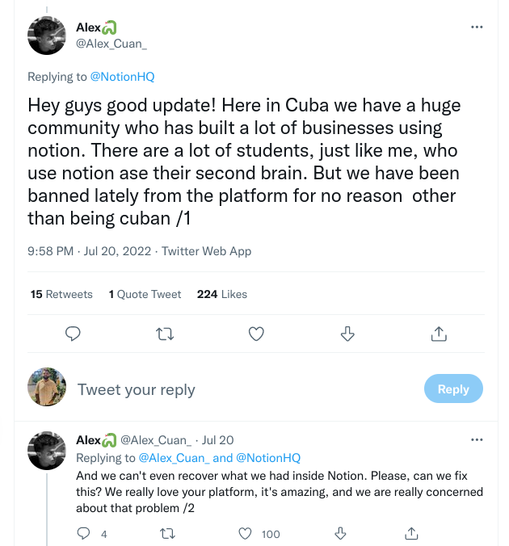
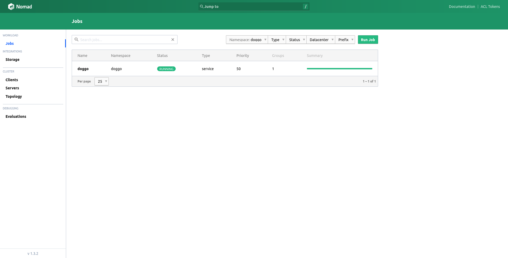
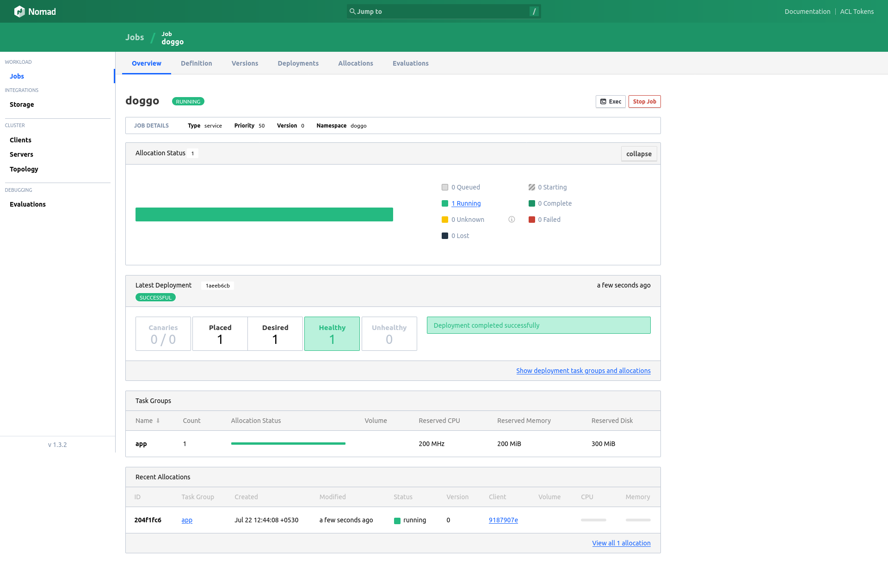
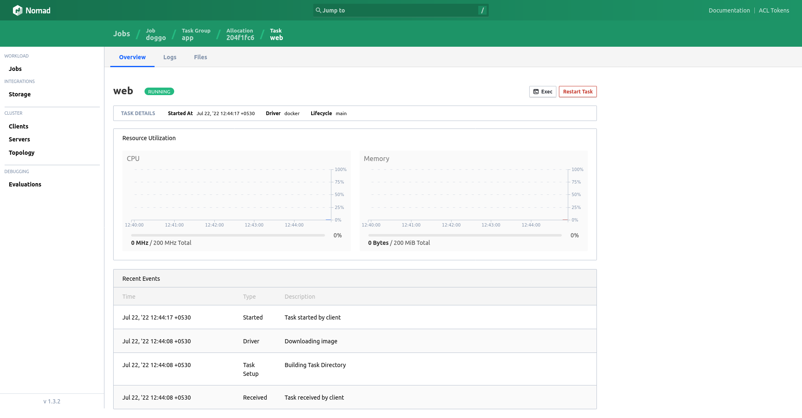
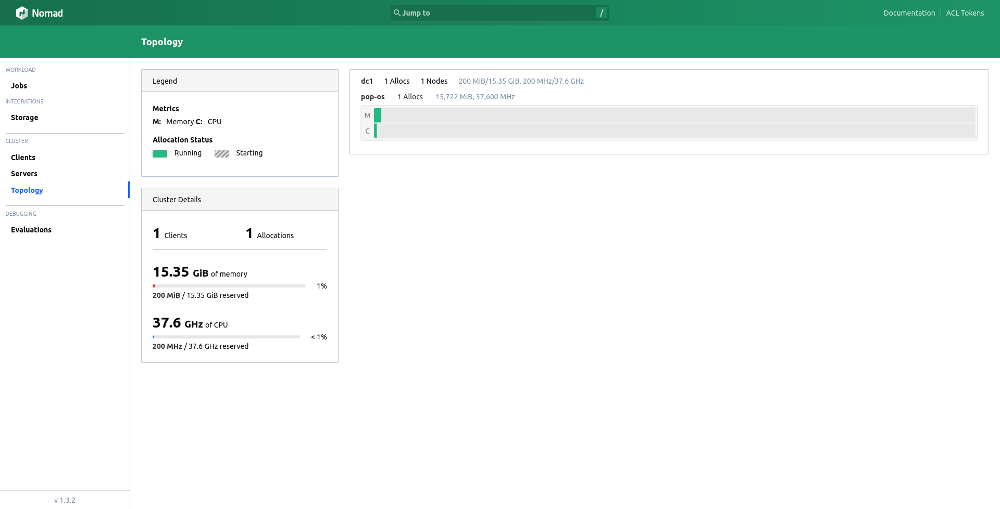
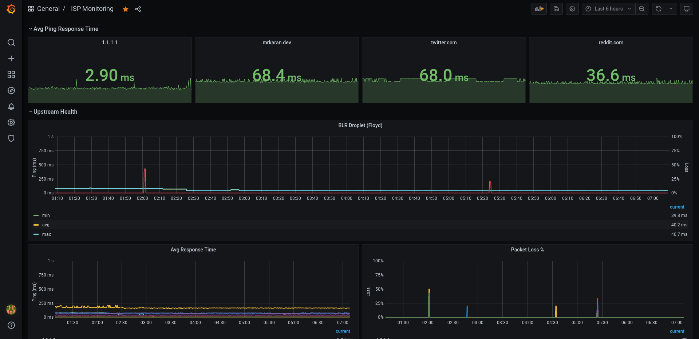

<!-- _class: lead -->

# Self Hosting with Nomad

My experiences of running and managing self hosted applications using Nomad.

Karan Sharma
[mrkaran.dev](https://mrkaran.dev)

---

# `whoami`

👨‍💻 Works at Zerodha

📓 Blogs about things I find interesting

📈 Interested in Self Hosting

---

# Why (I) Self Host

- Break from the Big Tech Co

---

# Why (I) Self Host

- Break from the Big Tech Co
- Own your data

---

# Why (I) Self Host

- Break from the Big Tech Co
- Own your data
- No lock ins for data which is critical

---

<!-- _class: lead -->



---

# Why (I) Self Host

- Break from the Big Tech Co
- Own your data
- No lock ins for data which is critical
- Chance to contribute to OSS

---

# Why (I) Self Host

- Break from the Big Tech Co
- Own your data
- No lock ins for data which is critical
- Chance to contribute to OSS
- Experiment and learn

---

# My Setup

## Servers

- DigitalOcean Droplet (2vCPU, 4GB RAM, blr1 Region)

---

# Infra Tools

- Ansible
- Terraform
- Nomad

---

## Ansible

- Boostrap the server
    - Harden SSH. User, Shell setups.
    - Install `node-exporter`, `docker`, `tailscale`.

---

## Terraform

- DigitalOcean infra
    - Droplet
    - Firewalls
    - SSH Keys, Volumes, Floating IPs etc.

- Cloudflare DNS records

---

## Nomad

- _Simple_ workload orchestrator and scheduler
- Run workloads with multiple task drivers (not just docker containers)

---

## Why Nomad

- Was using K8s before - went down the deep complexity hell
- Deployed my first app in a few minutes
- Single binary exectubale - with a UI

---

## Nomad Agent

- Server takes the scheduling decisions
  - For HA, run 3/5/7 nodes. (Raft consensus)

- Client runs the actual task given by the server
  - Interacts with task plugins like docker etc

---

## Ecosystem

Plugs into other Hashicorp tools very well

- Native integration with *Consul* Connect for ACLs
- Fetch secrets from *Vault*
- Deploy using *Waypoint*


---

## Running Nomad

- Grab the binary
- `nomad agent -dev` -> starts in dev mode. Great for local testing
- Configure `server.hcl`/`client.hcl`

---

## Jobspec

- A deployment file is called "Jobspec". Think of `docker-compose.yml`
- Specify all possible things to run that app in one file
  - Job -> Group -> Task
  - Artifact (S3/GitHub Releases/Remote config files)
  - Networking options
  - Volume mounts

---

## Deploying Gitea

```hcl
job "gitea" {
  datacenters = ["hydra"]
  type        = "service"
  group "app" {
    count = 1
    network {
      port "http" {
        to = 3000
      }
      port "ssh" {
        to           = 22
        static       = 4222
        host_network = "tailscale"
      }
    }
```

---

## Deploying Gitea

```hcl
    task "web" {
      driver = "docker"
      config {
        image = "gitea/gitea:latest"
        ports = ["http", "ssh"]
        mount {
          type   = "bind"
          source = "local/gitea.ini"
          target = "/data/gitea/conf/app.ini"
        }
      }
      resources {
        cpu    = 200
        memory = 300
      }
    }
```

---

## Deploying Gitea

```hcl
      service {
        provider = "nomad"
        name     = "gitea-web"
        tags     = ["gitea", "web"]
        port     = "http"
      }
      service {
        provider = "nomad"
        name     = "gitea-ssh"
        tags     = ["gitea", "ssh"]
        port     = "ssh"
      }
```

---

# Exploring the UI

---




---



---



---



---

# Networking

- Tailscale for "mesh network"
    - Based on Wireguard VPN.
    - Authenticated sessions only.
    - Expose services on an interbal network and access them on all devices

- Tailscale uses `100.64.0.0/10` subnet from the Carrier Grade NAT (CGNAT) space.

---


---

# Networking

- Caddy as a proxy for all services.
    - Running 2 instances of Caddy.
        - Private: Listens on Tailscale Interface.
        - Public: Listens on DO's public IPv4 Interface.

    - Automatic SSL with ACME DNS challenge
        - Built my own image: https://github.com/mr-karan/caddy-plugins-docker
---


---

# Networking

## Dont expose to the world

```s
doggo adguard.mrkaran.dev     
NAME                	TYPE	CLASS	TTL	ADDRESS       	NAMESERVER   
adguard.mrkaran.dev.	A   	IN   	23s	100.111.91.100	127.0.0.1:53
```

## unless required

```s
doggo doggo.mrkaran.dev
NAME              	TYPE	CLASS	TTL	ADDRESS       	NAMESERVER   
doggo.mrkaran.dev.	A   	IN   	25s	172.67.187.239	127.0.0.1:53	
doggo.mrkaran.dev.	A   	IN   	25s	104.21.7.168  	127.0.0.1:53	
```

---

# Storage

- Enable snapshots for volumes provided by cloud provider.
- Use separate DB instances for different applications.

---

# Backups

- Restic
    - Periodic Job in Nomad.
    - Single vault with everything inside `/data`.
    - All applications mount inside `/data` folder.
    - Upload to Backblaze B2.

---

# Services I run

- Adguard (DNS)
- Gitea (Git)
- Joplin Sync Server (Notes app)
- Miniflux (RSS reader)
- Plausible (Website Analytics)
- Grafana/Prometheus (Monitoring)
- Nextcloud (Documents/Photos)
- `doggo.mrkaran.dev` (DNS resolver)

---

# Monitoring

- Grafana
- Prometheus
- Telegraf to collect home ISP stats
    - Ping Input plugin
    - DNS Input Plugin

---



---


---

# Security

- If it should not be public facing, don't expose to WWW.
    - Prefer to use a VPN or mesh network instead of IP whitelists.
    - Tighter Firewall rules otherwise.

- Adguard, Gitea, etc Admin interfaces must always be protected with strong passwords.

- Periodic **updates** to App and OS.

---

# Takeaways

- Don't get overwhelmed by choices. Pick something really simple (like Adguard/Pi-hole) and host it.
- Aim for simplicity

---

# Resources


- [Mon School - Self Hosting 101 Course](https://mon.school/courses/self-hosting-101)
- [r/selfhosted](https://www.reddit.com/r/selfhosted)
    - Beginner friendly wiki: https://wiki.r-selfhosted.com/

- [github.com/awesome-selfhosted](https://github.com/awesome-selfhosted/awesome-selfhosted)
- [learn.hashicorp.com/nomad](https://learn.hashicorp.com/nomad)

---


<!-- _class: lead -->

# Thank You
